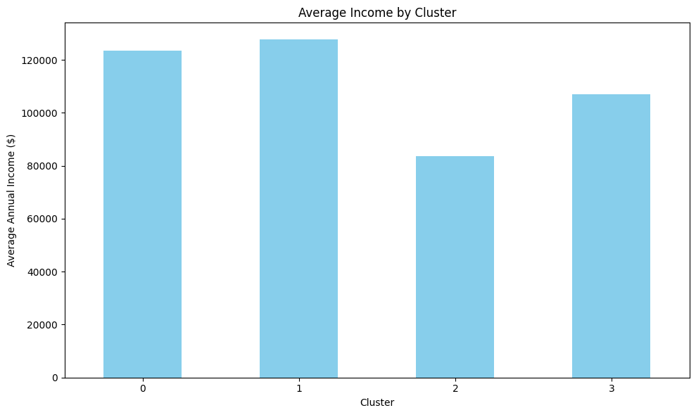

# Customer-Segmentation
Clustering algorithms based on various customer attributes (e.g., Age, Income, Spending Score, etc.) and visualizes the results through multiple plots. data from httpswww.kaggle.comdatasetsdatascientistannacustomers-dataset
## K-Means clustering algorithm
### Python code structure 
### Importing Required Libraries
pandas: Used for data manipulation and analysis.

**matplotlib.pyplot and seaborn:** For data visualization.

**LabelEncoder:** Converts categorical labels (like gender) into numeric values.

**StandardScaler:** Scales numerical features to have a mean of 0 and standard deviation of 1.

**KMeans:** The K-Means clustering algorithm, used for unsupervised learning.
### Data Handling
**df = pd.read_csv('Customers.csv')**   --> Gets the CSV file containing customer data.

**le = LabelEncoder() 
df['Gender'] = le.fit_transform(df['Gender'])**  --> LabelEncoder is used to convert the Gender column into binary. 

**df = pd.get_dummies(df, columns=['Profession'], drop_first=True)** -->One-Hot Encoding is applied to the Profession column. This creates a binary column for each profession.

**numeric_features = ['Age', 'Annual Income ($)', 'Spending Score (1-100)', 'Work Experience', 'Family Size']** --> Numerical columns of the dataset chosen for scaling.

**scaler = StandardScaler()**  

**scaled_data = scaler.fit_transform(df[numeric_features])** --> StandardScaler is used to scale the numeric features  making the K-Means algorithm more effective
### Elbow Method 
**wcss = []**

**for i in range(1, 11):** --> Model for a range of cluster numbers (1 to 10)

   **kmeans = KMeans(n_clusters=i, random_state=42)**
   
   **kmeans.fit(scaled_data)**
    
   **wcss.append(kmeans.inertia_)** -->measures the compactness of clusters 
###  Applying K-Means Clustering
**kmeans = KMeans(n_clusters=4, random_state=42)** --> K-Means is applied with n_clusters=4 to assign each customer to one of the 4 clusters.

**df['Cluster'] = kmeans.fit_predict(scaled_data)** --> The cluster labels are stored in a new column called Cluster in the DataFrame.
### Inverse Scaling
**original_values = scaler.inverse_transform(scaled_data)** --> Scaled data is converted back to its original scale for easier interpretation in visualizations.

**df[numeric_features] = original_values**
## Results 
### Clustering by Age, Income, Spending, Work Expirence and  Family Size

  
  
  

  
  
  

  
  

When using K-Means clustering, the number of features you include can significantly impact the quality of your results. More features can provide a richer dataset, allowing the model to capture a more detailed picture of the relationships between different variables. For example, by including features like Age, Annual Income, Spending Score, Work Experience, and Family Size, K-Means can identify more specific customer segments based on a range of characteristics. This can be especially useful when you want to create highly detailed clusters that reflect various aspects of customer behavior, such as targeting high-income customers with large families or understanding how spending habits vary across different age groups.

However, adding too many features can also create challenges. As the number of features increases, the data becomes more sparse in higher dimensions, making it harder for K-Means to effectively identify meaningful clusters. This is known as the **curse of dimensionality**, and it can lead to less accurate clustering results. The more features you add, the longer it takes to compute, which can significantly slow down the algorithm.This can be seen in the data plots as there is little clear clustering around the Income and Spending graph. Additionally, if some of the features are irrelevant or redundant, they can introduce noise, making it harder for the algorithm to find clear patterns. It also becomes more difficult to interpret the clusters, as they may represent complex combinations of many features, which can reduce the overall usefulness of the model.

### Clustering by Income and Spending

  
  
  

  
  
  

  

Clustering by income and spending can help identify distinct customer segments based on their financial behavior. By grouping individuals with similar annual incomes and spending scores, K-Means can uncover patterns, such as high-income, low-spending customers or low-income, high-spending customers. This approach allows businesses to tailor marketing strategies, products, and services to specific groups, ensuring more targeted and effective customer engagement. In this case the Income and Spending plot have been divided into quarters by the clusters.

### Clustering by Age and Spending

  
  
  
  

  
  
  

  

Clustering by age and spending helps identify customer segments based on their life stage and purchasing behavior. For example, younger customers may have a higher spending score due to lifestyle or disposable income, while older customers might have more conservative spending habits. By grouping individuals in this way, businesses can better target age-appropriate products, services, or marketing campaigns to specific groups, enhancing customer engagement and satisfaction.

### Clustering by Gender and Spending

  
  
  

  
  
  

  

In this case, where there are more men but spending and income are similar between genders, clustering by gender and spending might not reveal significant differences in financial behavior. Since both genders have similar spending patterns and income levels, the clusters could be more influenced by other factors, such as age or family size, rather than gender alone. This suggests that, in this particular dataset, gender may not be a strong driver of spending behavior, and businesses might need to focus on other characteristics for more effective segmentation.

## DBSCAN
**Density-Based Spatial Clustering of Applications with Noise** has several advantages and disadvantages depending on the dataset. One of its main benefits is that it can handle arbitrarily shaped clusters, unlike K-Means, which assumes spherical clusters. This makes DBSCAN more versatile for real-world data, where clusters might not follow simple geometries. Additionally, DBSCAN can identify noise or outliers by marking points that don’t belong to any cluster, which is useful in datasets with noise. Another advantage is that it doesn't require specifying the number of clusters in advance, unlike K-Means. Instead, DBSCAN uses point density to determine clusters, making it more natural for certain types of data. Moreover, DBSCAN can be efficient with large datasets when optimized data structures are used.

However, DBSCAN does have its drawbacks. It is sensitive to the choice of two key parameters: eps (the radius that defines neighborhood points) and min_samples (the minimum number of points to form a cluster). If these parameters are not chosen correctly, the algorithm may perform poorly. Additionally, DBSCAN struggles with datasets containing clusters of varying densities, as it may fail to detect smaller, denser clusters or merge them with sparser ones. The algorithm also doesn't perform well with high-dimensional data due to the "curse of dimensionality," where the concept of neighborhood becomes less meaningful. Finally, DBSCAN has difficulty handling overlapping clusters, as it may treat them as a single cluster or fail to separate them correctly. While DBSCAN is a powerful clustering tool, it requires careful tuning and may not always be suitable for all datasets.
### Results 

  
  
  

  
  

DBSCAN didn’t work well with the customer data because the dataset contained clusters with varying densities, which DBSCAN struggles to handle. Additionally, the algorithm’s performance is highly sensitive to the choice of parameters like eps and min_samples, and if these were not correctly tuned, it could either merge distinct groups or classify too many points as noise. The customer data also had multiple features, making it high-dimensional, and DBSCAN struggles in higher dimensions due to the diminishing relevance of "neighborhood" relationships. Furthermore, overlapping clusters in the data, where customer segments shared characteristics, made it difficult for DBSCAN to accurately separate them, leading to poor clustering results.

## Hierarchical Clustering

Hierarchical Clustering offers the advantage of not requiring a predefined number of clusters, as it generates a dendrogram that visually shows how clusters form, allowing for flexible decision-making. It's particularly useful for datasets with hierarchical relationships and provides an intuitive visualization of clustering. Additionally, it is easy to implement for small to medium-sized datasets without needing complex parameter tuning. However, it has significant drawbacks, including scalability issues for large datasets due to its high computational cost (O(n²) or O(n³)). It is also sensitive to noise and outliers, which can distort the clustering process, and it struggles with non-spherical clusters or data with varying cluster sizes and densities. These limitations make hierarchical clustering less ideal for large, noisy, or complex datasets.

### Results 

  
  
  

  
  
  

  

Hierarchical clustering didn't work well with the customer data primarily due to the noise and outliers present in the dataset. The method is sensitive to these irregularities, and as a result, the algorithm tended to create too many clusters, splitting the data into small, less meaningful groupings. Since hierarchical clustering starts with each data point as its own cluster and progressively merges them, noise and outliers can distort the process, causing it to make unnecessary splits or merges. In the case of customer data, where there are likely varying spending patterns, income levels, and other features, the presence of noise likely caused the algorithm to overfit, resulting in excessive clusters that don’t reflect actual customer segments. This made the clustering less effective in capturing meaningful patterns, and the large number of clusters generated didn’t provide useful insights for segmenting the customer base.

## Sources
httpswww.kaggle.comdatasetsdatascientistannacustomers-dataset - for customer data 
